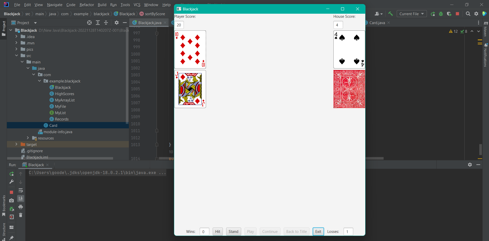
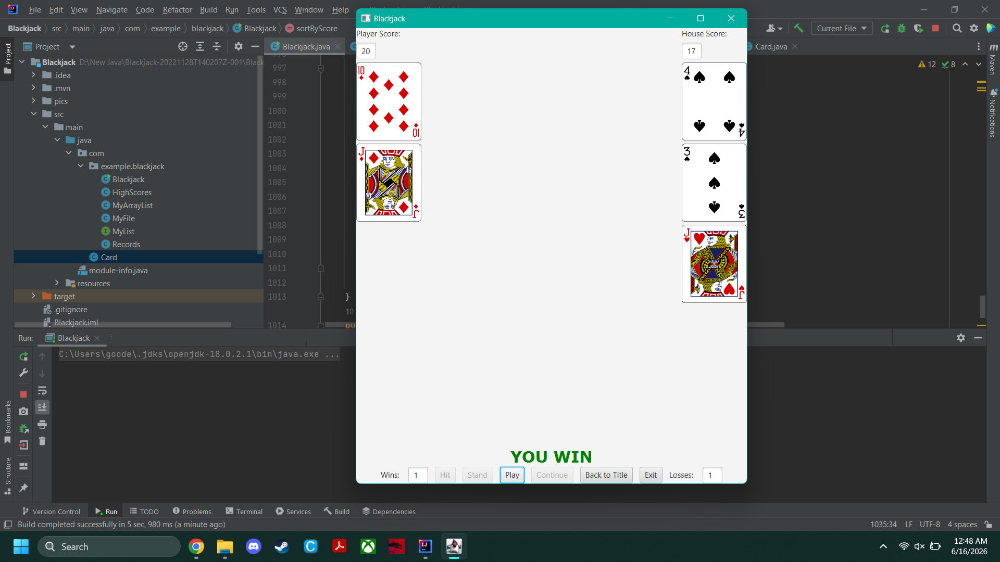

# Blackjack (JavaFX)
A fully playable Blackjack game built in Java with JavaFX, featuring 
a graphical UI, persistent high scores, and win/loss tracking across 
sessions. Originally built during an attempted bachelor's degree 
program, revisited and cleaned up as a portfolio piece.

## What It Does
- Full Blackjack gameplay: hit, stand, dealer AI following standard 
  house rules, win/loss/push/blackjack detection
- Persistent high score leaderboard (top 20, saved to CSV)
- Persistent win-record tracking across sessions
- Animated title screen and rules screen




## What's Custom-Built (Not Just Java's Standard Library)
This project intentionally avoids relying entirely on `java.util` 
collections and sorting utilities in a couple of places, to demonstrate 
understanding of what those tools are actually doing underneath.

**A custom dynamic array implementation (`MyArrayList`)** instead of 
using `java.util.ArrayList` directly:
```java
public void add(Object o){
    if(size==obj.length){
        Object[] obj2 = new Object[obj.length*2+1];
        for (int i=0; i<obj.length; i++){
            obj2[i]=obj[i];
        }
        obj=obj2;
    }
    obj[size]=o;
    size++;
}
```
This handles the classic fixed-size-array-underneath problem — when 
the backing array fills up, it allocates a larger one and copies the 
existing elements over, rather than relying on a built-in collection 
to handle that invisibly.

**A hand-written bubble sort** for the high score leaderboard, instead 
of `Collections.sort()`:
```java
public void sortByScore(){
    int size = scores.size();
    int end = size-1;
    boolean sorted = false;
    for (int i = 0; i < size-1 && !sorted; i++){
        sorted = true;
        for (int j=0; j<end; j++){
            HighScores y1 = (HighScores) scores.get(j);
            HighScores y2 = (HighScores) scores.get(j+1);
            if (y1.getScore()< y2.getScore()){
                sorted = false;
                scores.remove(j);
                scores.add(j+1, y1);
            }
        }
        end--;
    }
}
```
Includes an early-exit optimization — if a full pass makes no swaps, 
the list is already sorted and the loop exits early rather than 
running all remaining passes unnecessarily.

## How to Run
1. Clone the repository
2. Open in an IDE with JavaFX configured (or link the JavaFX SDK 
   manually if running via command line)
3. Ensure the `pics/` folder (card images) is present in the working 
   directory
4. Run `Blackjack.java`

## Known Limitations
- There is an edge case in the Ace soft/hard value logic that can 
  produce an incorrect hand total in rare multi-Ace scenarios (e.g. 
  Ace + Ace + Ace) — the current logic only rechecks the Ace value 
  card-by-card rather than re-evaluating the full hand
- Some house-dealer logic (`houseCont`, `houseCont2`, `houseCont3`, 
  `houseCont4`) and the high-score page loader are repetitive and could 
  be refactored into loops or arrays rather than near-duplicated blocks
- `toString()` is repurposed to draw a random card rather than describe 
  an object, which works but isn't conventional Java practice — a 
  method like `drawCard()` would be clearer
